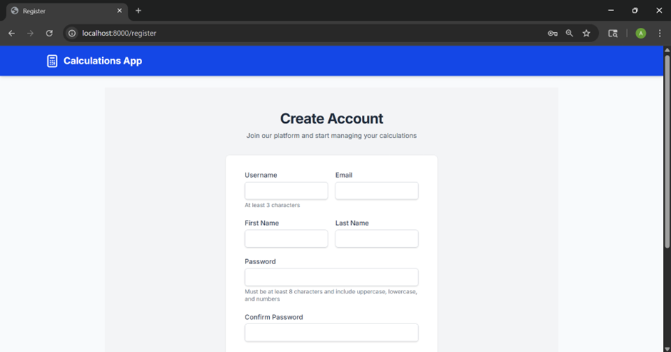
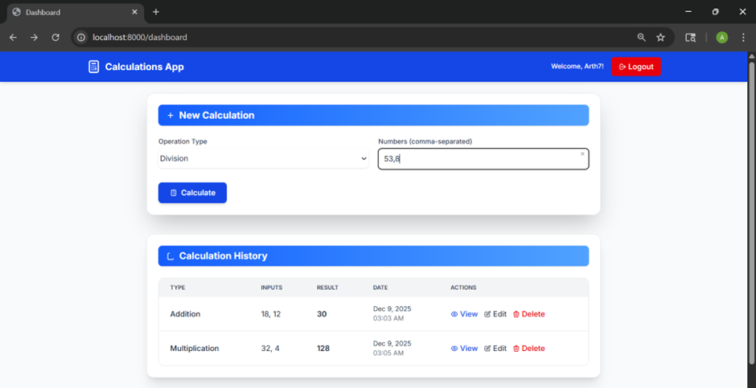

# Assignment 14 – Complete BREAD Functionality for Calculations  
This project implements full BREAD operations (Browse, Read, Edit, Add, Delete) for user calculations.  
It includes backend API endpoints, front-end pages, database models, authentication, E2E tests, and CI/CD using GitHub Actions and Docker.

---

## ✅ Features Implemented

### **BREAD Operations**
- **Browse** – `/calculations` → view all calculations for logged-in user  
- **Read** – `/calculations/{id}` → view details of a single calculation  
- **Add** – `/calculations` → create new calculation (auto-compute result)  
- **Edit** – `/calculations/{id}` → update existing calculation  
- **Delete** – `/calculations/{id}` → remove calculation  

### **JWT Authentication**
- Secure login + register  
- Password hashing  
- User-specific data access  

### **Front-End Functionality**
- Fully styled UI (Tailwind + Jinja)  
- Forms for create/edit  
- Client-side validation  
- Calculation history, view, edit, delete pages  

### **Automated Testing**
- Unit tests  
- Integration tests  
- Playwright end-to-end tests (UI flow)  
- Coverage included  

### **CI/CD Pipeline**
- GitHub Actions  
- Runs full test suite  
- Builds Docker image & pushes to Docker Hub  

---

## 📂 Project Structure
```

.github/
 └── workflows/
      └── test.yml
.vscode/
 └── settings.json

app/
 ├── auth/
 │    ├── __init__.py
 │    ├── dependencies.py
 │    ├── jwt.py
 │    └── redis.py
 ├── core/
 │    ├── __init__.py
 │    └── config.py
 ├── models/
 │    ├── __init__.py
 │    ├── calculation.py
 │    └── user.py
 ├── operations/
 │    └── __init__.py
 ├── schemas/
 │    ├── __init__.py
 │    ├── base.py
 │    ├── calculation.py
 │    ├── token.py
 │    └── user.py
 ├── __init__.py
 ├── main.py
 ├── database.py
 ├── database_init.py

static/
 ├── css/
 │    └── style.css
 └── js/
      └── script.js

templates/
 ├── layout.html
 ├── index.html
 ├── login.html
 ├── register.html
 ├── dashboard.html
 ├── edit_calculation.html
 ├── view_calculation.html

tests/
 ├── __init__.py
 ├── conftest.py
 ├── unit/
 │    ├── __init__.py
 │    └── test_calculator.py
 ├── integration/
 │    ├── __init__.py
 │    ├── test_calculation.py
 │    ├── test_calculation_schema.py
 │    ├── test_database.py
 │    ├── test_dependencies.py
 │    ├── test_schema_base.py
 │    ├── test_user_auth.py
 │    └── test_user.py
 └── e2e/
      ├── __init__.py
      ├── test_e2e.bk
      └── test_fastapi_calculator.py

docker-compose.yml  
Dockerfile  
init-db.sh  
pytest.ini  
requirements.txt  
README.md  
LICENSE  
.gitignore


```

## 🚀 Getting Started

### Prerequisites

- Python 3.10 or higher
- Docker Desktop
- Node.js 18+ (for Playwright)
- Git

### Installation

#### Option 1: Docker Setup

1. **Clone the repository**
   ```bash
   git clone https://github.com/ArthNangar/assignment13.git
   cd assignment13
   ```

2. **Start the application with Docker Compose**
   ```bash
   docker-compose up --build
   ```

3. **Access the application**
   ```bash 
     http://localhost:8000/

#### Local Setup

1. **Clone the repository**
   ```bash
   git clone  https://github.com/ArthNangar/assignment14.git
   cd assignment-14
   ```

2. **Create and activate virtual environment**
   ```bash
   # Mac/Linux
   python3 -m venv venv
   source venv/bin/activate

   # Windows
   python -m venv venv
   venv\Scripts\activate
   ```

3. **Install Python dependencies**
   ```bash
   pip install -r requirements.txt
   ```
4. **Build Docker image:**
   ```bash
   docker compose build

   docker compose up

   Services:
   FastAPI backend → http://localhost:8000

   Stop:
   docker compose down --volumes


## Automated Testing

### **1. Pytest**
- Unit tests (operations, utilities)
- Integration tests (models, schemas, dependencies)
- E2E API tests (auth + calculations)
- Test coverage included


## Screenshots

### ✅ GitHub Actions – Successful CI/CD Run


### Frontend Register Page


### Frontend Dashboard Page



##  License
This project is licensed under the MIT License.
See LICENSE for details.

## Acknowledgments

FastAPI Documentation

Docker Docs

PostgreSQL Docs

pgAdmin Docs


## 👨‍💻 Author
Arth Nangar

Date: 12/08/2025

Module 14
